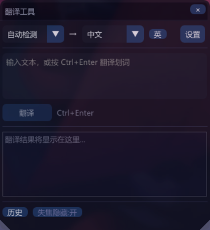
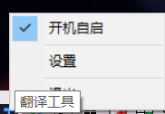

# TranslationTool — 桌面翻译浮窗

Windows 桌面悬浮翻译工具。选中文本 → 按快捷键 → 即时翻译。

## 截图

| 主界面 | 托盘右键 |
|---|---|
|  |  |

## ✨ 功能

| 功能 | 说明 |
|---|---|
| **划词翻译** | 在任何应用中选中文本，按 `Ctrl+Alt+T` 自动翻译 |
| **手动输入** | 在浮窗中直接输入文字，点击"翻译"或按 `Ctrl+Enter` |
| **多引擎** | 百度 → 有道 → 必应 → MyMemory 四级自动降级 |
| **语言自动检测** | 源语言设为"自动检测"即可 |
| **翻译历史** | 自动保存，支持搜索、筛选 |
| **复制结果** | 一键复制翻译结果到剪贴板 |
| **窗口拖拽** | 按住标题栏任意位置拖拽 |
| **窗口缩放** | 右下角 / 左下角拖拽调整大小 |
| **透明度调节** | 设置页滑条调节窗口透明度 |
| **失焦自动隐藏** | 开启后点击其他窗口自动隐藏 |
| **开机自启** | 设置页勾选（写入注册表 Run 项） |
| **快速切换目标语言** | 翻译按钮旁一键切换中/英目标语言 |
| **系统托盘** | 右键托盘图标显示菜单（开机自启 → 设置 → 退出） |
| **丙烯酸模糊** | Windows 10/11 下窗口背景毛玻璃效果 |

## ⌨ 快捷键

| 快捷键 | 作用 |
|---|---|
| `Ctrl+Alt+T` | **全局热键** — 在任何应用中选中文本后按下，捕获选中文本并打开翻译窗口 |
| `Ctrl+Enter` | 在输入框中按下，触发翻译 |
| `Esc` | 隐藏窗口到系统托盘 |

## 🔄 翻译引擎优先级

工具自动按以下顺序尝试翻译，直到某个引擎成功：

```
百度翻译 ── 你有 API Key 时的首选，最稳定
  ↓ (失败)
有道翻译 ── 备选 API Key 引擎
  ↓ (失败)
必应翻译 ── 免费，国内可用，无需任何配置
  ↓ (失败)
MyMemory ── 海外在线翻译，国内可能被屏蔽
```

**提示**：
- 配置百度或有道密钥后，引擎自动启用，无需手动切换
- 什么都不配置时，默认走必应翻译（国内可用）
- 每个引擎失败后会自动降级到下一个

## 🔑 注册与配置

两个 API 引擎任选其一配置即可。

### 百度翻译（推荐 · 100万字符/月免费）

1. 打开 [百度翻译开放平台](https://fanyi-api.baidu.com/)
2. 注册登录 → 开发者信息认证
3. 创建应用 → 选择「通用文本翻译」服务
4. 获取 **App ID** 和 **密钥**
5. 在工具设置页填入并保存

### 有道翻译（50元体验金）

1. 打开 [有道智云AI开放平台](https://ai.youdao.com/)
2. 注册登录 → 创建应用 → 选择「文本翻译」服务
3. 获取 **应用 ID** 和 **应用密钥**
4. 在工具设置页填入并保存

### 必应翻译（零配置）

无需任何注册配置，开箱即用。基于 `cn.bing.com` 内部翻译接口。

## ⚙ 设置项

打开设置页（主界面点击「设置」按钮）：

| 设置项 | 说明 |
|---|---|
| 百度翻译 App ID / 密钥 | 选填，配置后自动启用百度引擎 |
| 有道翻译 应用 ID / 密钥 | 选填，配置后自动启有有道引擎 |
| 验证按钮 | 验证 API Key 是否有效 |
| 开机自启 | 登录 Windows 时自动启动 |
| 默认目标语言 | 翻译到的语言 |
| 窗口透明度 | 50–255 滑条调节 |
| 失焦自动隐藏 | 勾选后点击其他窗口自动隐藏到托盘 |

## 📦 构建

需要 Visual Studio 2022/2026 或更高版本（v145 平台工具集）。

### 构建脚本

| 脚本 | 说明 |
|---|---|
| `build_and_run.bat` | 构建 Debug 并自动启动 |
| `build_release.bat` | 仅构建 Release，不启动 |

直接双击运行即可（自动检测 VS 路径）。

### 手动构建

从 **VS 开发者命令提示符** 运行：

```cmd
msbuild TranslationTool.vcxproj /p:Configuration=Debug /p:Platform=x64
```

Release 版（无 CRT 调试断言，运行更稳定）：

```cmd
msbuild TranslationTool.vcxproj /p:Configuration=Release /p:Platform=x64
```

构建产物在 `x64\Debug\TranslationTool.exe` 或 `x64\Release\TranslationTool.exe`。

### 依赖项

已包含在 `external/` 目录：
- [Dear ImGui](https://github.com/ocornut/imgui) — GUI 框架
- [nlohmann/json](https://github.com/nlohmann/json) — JSON 解析
- DirectX 11 / WinHTTP / Windows SDK（系统自带）
